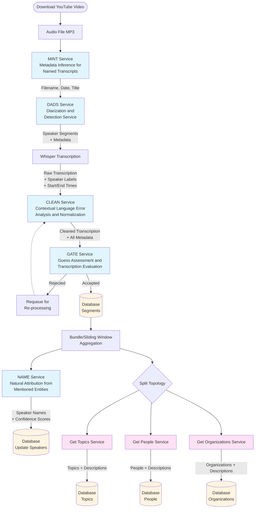

# Transcribinator Pipeline

A comprehensive audio transcription and analysis pipeline for processing YouTube videos through multiple AI services.

## System Architecture



## Pipeline Stages

### 1. Download Stage
Downloads YouTube videos in audio-only mode using `yt-dlp`:
```bash
yt-dlp -f "bestaudio" -x --audio-format mp3 --dateafter now-15years --sleep-interval 3600 "https://www.youtube.com/@egovpdx8714/videos"
```

### 2. MINT Service
**Metadata Inference for Named Transcripts**
- Extracts metadata from filename
- Infers date and title information

### 3. DADS Service
**Diarization and Detection Service**
- Processes audio for speaker diarization
- Produces speaker segments with timing information
- Publishes to RabbitMQ queue

### 4. Whisper Transcription
- Transcribes audio segments
- Preserves metadata:
  - Filename, date, title
  - Start/end times
  - Speaker labels

### 5. CLEAN Service
**Contextual Language Error Analysis and Normalization**
- AI-powered cleanup of transcriptions
- Preserves all metadata including original transcription

### 6. GATE Service
**Guess Assessment and Transcription Evaluation**
- Quality checks cleaned transcriptions
- Accepts or rejects segments
- Accepted segments stored in database
- Rejected segments requeued

### 7. NAME Service
**Natural Attribution from Mentioned Entities**
- Speaker identification from transcript bundles
- Updates database with speaker names and confidence scores
- Uses sliding window approach

### 8. Parallel Analysis (Post-Cut Line)
Three parallel services process bundled transcriptions:

#### Get Topics Service
- Extracts topics and descriptions
- Stores in database

#### Get People Service
- Identifies people mentioned
- Stores with descriptions

#### Get Organizations Service
- Identifies organizations mentioned
- Stores with descriptions

## Message Flow
All services communicate via RabbitMQ queues, preserving metadata throughout the pipeline:
- Filename
- Date
- Title
- Start/End times
- Speaker labels
- Original/raw transcription
- Confidence scores
