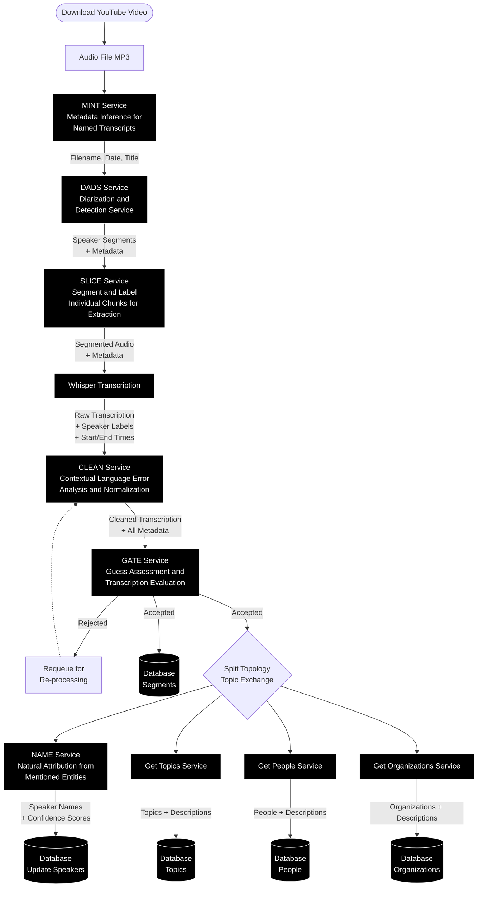

# Power Mapper Pipeline

Takes unstructured data, uses AI pipeline to make it usable.

## Goals
I have two co-equal goals in developing this code: Personal education/development, and that I hope it will be
genuinely useful. Please look kindly on the code, I'm developing it on my own in my spare time. I understand
there are standards I'm not following, such as an OpenAI-compatible web service for LLM requests, or even Ollama
Server. I've chosen to roll my own code for those things, not because it's the right technical dexision but
because it helps me educate myself. It is also a project in very early stages.

Goal: Take in unstructured data like YouTube videos of city council meetings, news articles, congressional voting
records, speeches, and anything else we can think to feed it. Produce a, "power map." -- A graph in a graphing
database of which people care about which issues, do they support or oppose the issues, what are their connections,
both to other people and to organizations?

Ideally, this will help answer questions like, "I care about Issue X, how do I get involved?"

## System Architecture



## Pipeline Stages

### 1. Download Stage
Downloads YouTube videos in audio-only mode using `yt-dlp`:
```bash
yt-dlp -f "bestaudio" -x --audio-format mp3 --dateafter now-15years --sleep-interval 3600 "https://www.youtube.com/@egovpdx8714/videos"
```

### 2. MINT Service
**Metadata Inference for Named Transcripts**
- Extracts metadata from filename
- Infers date and title information

### 3. DADS Service
**Diarization and Detection Service**
- Processes audio for speaker diarization
- Produces speaker segments with timing information
- Publishes to RabbitMQ queue

### 4. Whisper Transcription
- Transcribes audio segments
- Preserves metadata:
  - Filename, date, title
  - Start/end times
  - Speaker labels

### 5. CLEAN Service
**Contextual Language Error Analysis and Normalization**
- AI-powered cleanup of transcriptions
- Preserves all metadata including original transcription

### 6. GATE Service
**Guess Assessment and Transcription Evaluation**
- Quality checks cleaned transcriptions
- Accepts or rejects segments
- Accepted segments stored in database
- Rejected segments requeued

### 7. NAME Service
**Natural Attribution from Mentioned Entities**
- Speaker identification from transcript bundles
- Updates database with speaker names and confidence scores
- Uses sliding window approach

### 8. Parallel Analysis (Post-Cut Line)
Three parallel services process bundled transcriptions:

#### Get Topics Service
- Extracts topics and descriptions
- Stores in database

#### Get People Service
- Identifies people mentioned
- Stores with descriptions

#### Get Organizations Service
- Identifies organizations mentioned
- Stores with descriptions

## Message Flow
All services communicate via RabbitMQ queues, preserving metadata throughout the pipeline:
- Filename
- Date
- Title
- Start/End times
- Speaker labels
- Original/raw transcription
- Confidence scores
